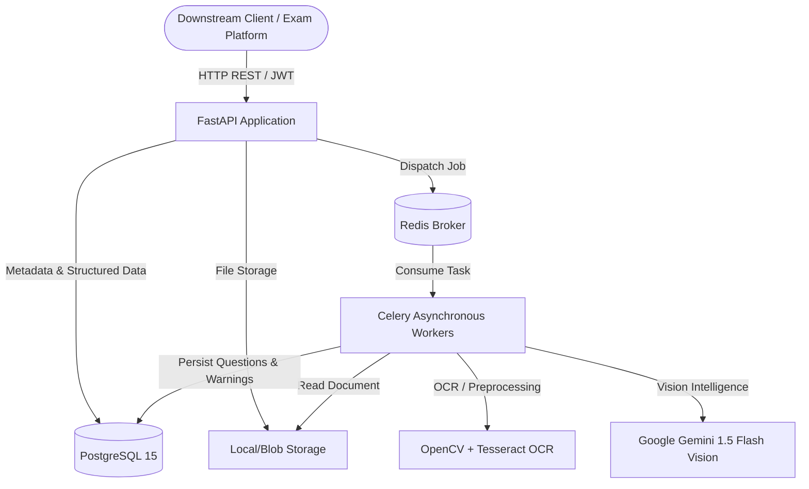
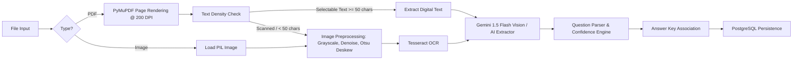

# Architecture & System Design Documentation

**Service:** Document Intelligence & Question Extraction Service  
**Company:** Pragati Bharati  
**Version:** 1.0.0  

---

## 1. Executive Summary & System Overview

The **Question Extraction Service** is a resilient, event-driven backend service engineered to transform unstructured and semi-structured examination documents (PDFs, scanned documents, and images) into standardized, machine-readable question models.

The system is designed specifically to handle the messy reality of exam documents: multi-column formats, poor scan quality, rotation, split questions across pages, missing numbering, and detached or separate answer keys.

---

## 2. Core Architecture & Workflow

### 2.1 Request Lifecycle & Asynchronous Processing
Document processing is compute-intensive and can take anywhere from 2 to 30 seconds depending on page count and OCR requirements. Therefore, synchronous execution would violate client timeouts.

1. **Upload (`POST /documents/upload`)**:
   - The file is received by FastAPI, inspected for MIME type and file size.
   - The file is securely stored on disk using a cryptographically random UUID to prevent collisions or path traversal.
   - A `Document` record is inserted with `status = PENDING`.
   - A task `process_document_task` is dispatched to Redis via Celery.
   - FastAPI immediately responds with `202 Accepted` returning the `document_id`.

2. **Background Execution (Celery Worker)**:
   - Worker picks up the job with `task_acks_late=True` ensuring zero task loss on worker restart.
   - Worker transitions the document to `PROCESSING`.
   - The document is processed page-by-page.
   - Any layout ambiguities, low-confidence extractions, or OCR errors are recorded as `ExtractionWarning` records linked to the document and specific questions.
   - On completion, status is updated to `COMPLETED` (or `PARTIALLY_PROCESSED` / `FAILED`).

3. **Client Polling & Retrieval**:
   - Client polls `GET /documents/{id}/status`.
   - Once completed, client retrieves:
     - `GET /documents/{id}/questions` (Structured questions, options, answers, confidence)
     - `GET /documents/{id}/warnings` (Audit trail of issues requiring human review)

---

## 3. Document Processing Pipeline

### 3.1 PDF Rendering & Image Quality Handling
- **PyMuPDF (`fitz`)**: We render PDF pages at 200 DPI (`PAGE_RENDER_DPI = 200`), offering the optimal trade-off between character clarity and memory consumption.
- **Blur Detection**: Using OpenCV's Laplacian variance operator (`cv2.Laplacian`), images with variance below threshold `100.0` are flagged with `BLURRY_IMAGE` warnings.
- **Deskewing & Thresholding**: Scanned documents undergo bilateral filtering (smoothing noise while preserving edge sharpness) and Otsu thresholding before feeding to Tesseract.

---

## 4. Technology Choices & Justification

| Component | Choice | Justification |
| :--- | :--- | :--- |
| **API Framework** | **FastAPI** | High performance (ASGI), automatic OpenAPI 3.0 schema generation, asynchronous DB support via `asyncpg`, robust Pydantic data validation. |
| **Database** | **PostgreSQL 15** | ACID compliance, native JSONB support for storing variable options and page lists, relational integrity with cascading deletes. |
| **ORM / Migration** | **SQLAlchemy 2.0 + Alembic** | Modern typed async ORM with complete migration version control. |
| **Task Queue** | **Celery + Redis** | Industry standard for Python distributed task execution, support for retries, time limits, and rate limiting. |
| **Vision & Extraction** | **Google Gemini 1.5 Flash** | Multi-modal vision model capable of zero-shot parsing of multi-column layouts, tables, mathematical notations, and cross-page continuous text. |
| **Fallback OCR** | **Tesseract 5 + OpenCV** | Zero external API dependency fallback for air-gapped environments or API quota exhaustion. |

---

## 5. Question Extraction & Confidence Engine

### 5.1 Multi-Factor Confidence Scoring
Every question is assigned a `confidence` score between `0.0` and `1.0` calculated via a weighted multi-factor heuristic:

$$\text{Confidence} = 0.40 \cdot C_{\text{model}} + 0.25 \cdot C_{\text{OCR}} + 0.20 \cdot C_{\text{num}} + 0.15 \cdot C_{\text{opts}}$$

Where:
- $C_{\text{model}}$: Model self-reported confidence or extraction certainty.
- $C_{\text{OCR}}$: Average word-level OCR confidence from Tesseract (or 0.95 for digital text).
- $C_{\text{num}}$: $1.0$ if a clear question number was detected, $0.5$ if missing or inferred.
- $C_{\text{opts}}$: $1.0$ if question type is MCQ and has $\ge 2$ options, or if type is subjective.

### 5.2 Review Thresholds
- $\text{Confidence} \ge 0.70$: Status = `EXTRACTED`
- $\text{Confidence} < 0.70$: Status = `REVIEW_REQUIRED`, generates `LOW_CONFIDENCE` warning.
- Missing options in MCQ: Status = `PARTIAL`, generates `PARTIAL_OPTIONS` warning.

---

## 6. Answer Key Association Strategy

The system handles both intra-document and inter-document answer keys:

### 6.1 Intra-Document (Same Document)
1. **Section Detection**: The service inspects each page for markers like `Answer Key`, `Answers:`, `Solutions`, or tabular numbering blocks (`1. (A) 2. (B) ...`).
2. **Parsing**: Regex patterns extract mappings like `{"1": "A", "2": "C"}` or `{"Q1": "True"}`.
3. **Linking**: Questions matching the key are populated with `answer_source = SAME_DOCUMENT` and `answer_confidence = 0.90`.

### 6.2 Inter-Document (Cross-Document via Groups)
1. Multiple documents can be bundled into a `DocumentGroup` (e.g. `Physics_Midterm.pdf` + `Physics_Answers.pdf`).
2. If a document is tagged with `is_answer_key = True`, the answer associator maps answers across all companion documents in the same group.

---

## 7. Security Architecture

1. **Authentication & Authorization**:
   - Industry-standard JWT (JSON Web Tokens) with HS256 encryption.
   - Passwords hashed using bcrypt with salt rounds.
   - Resource isolation: users can only view or delete documents they own (`user_id` enforced in SQL filters).
2. **File Security**:
   - Magic byte validation using `python-magic` to prevent MIME spoofing (e.g. executable disguised as a PDF).
   - Random UUID storage naming (`uuid4().hex`) prevents path traversal and filename injection.
   - Strict 50 MB upload limit.
3. **Secrets Management**:
   - All credentials loaded exclusively from environment variables via `pydantic-settings`.
   - Zero hardcoded secrets in codebase or Docker images.

---

## 8. Scalability & Production Readiness

- **Stateless API Layer**: The FastAPI app is completely stateless. It can be horizontally scaled across multiple instances behind a load balancer (NGINX / AWS ALB).
- **Worker Concurrency**: Celery workers can be scaled independently of the API based on queue length.
- **Resource Constraints**: Celery worker prefetch is set to 1 (`worker_prefetch_multiplier = 1`) to prevent a single worker node from running out of RAM during high-resolution PDF rendering.
- **Graceful Retries**: Network timeouts to external APIs feature exponential backoff with up to 3 automatic retries.
